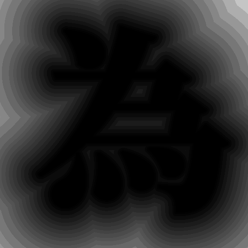
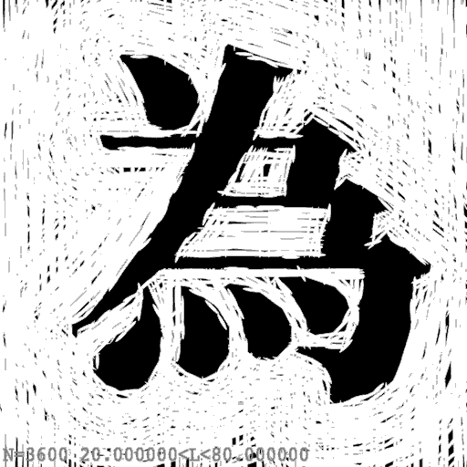
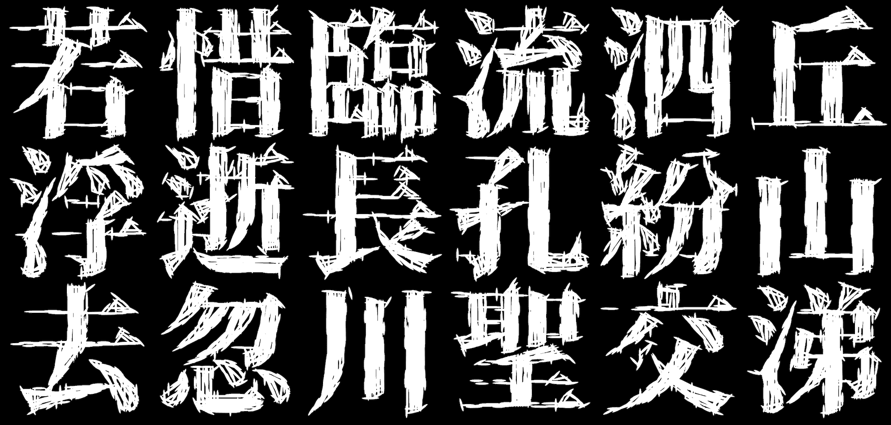
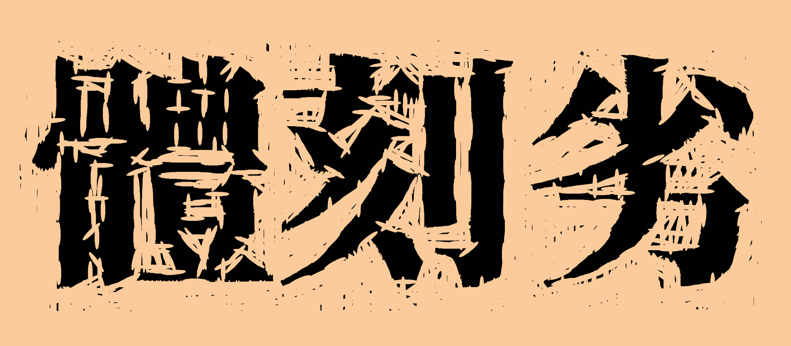
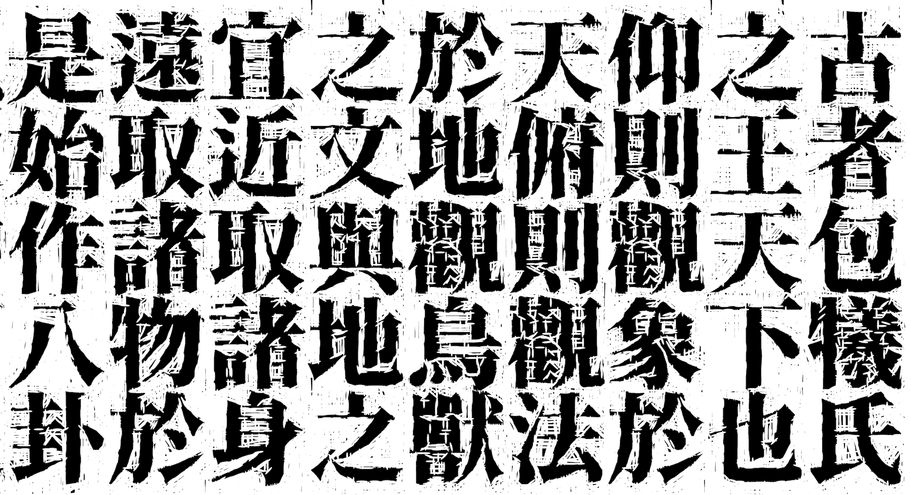
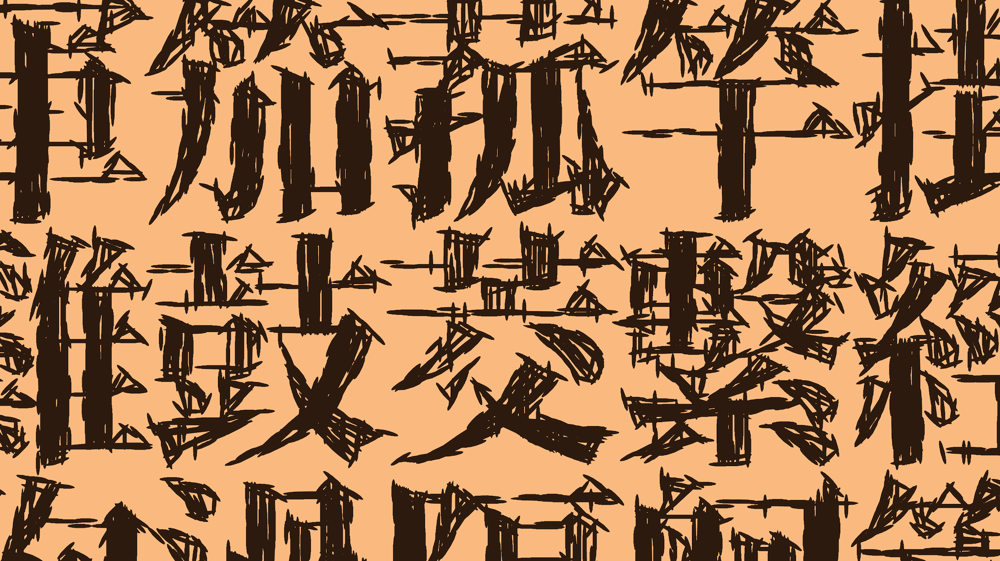
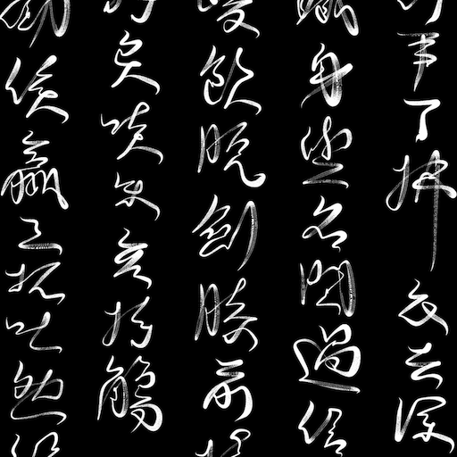
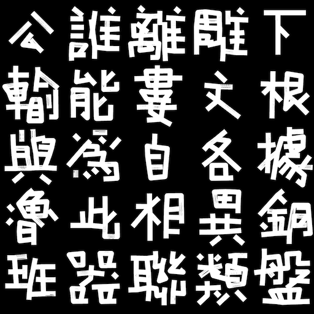

# Bad Cut 劣刻體

Algorithmically-generated Chinese typeface with a raw, woodcut-inspired look, made by simulating the wood carving process on [Source Han Serif](https://github.com/adobe-fonts/source-han-serif). Featuring both positive (empty sapce carved away) and negative polarity (text carved away) versions. Handmade artifacts that are usually unnoticeable in traditional and more sophisticated woodblock printing styles are exaggerated in this experimental typeface, which makes it more suitable for typesetting stylized headings than for historical text.

**The TrueType Fonts can be [downloaded](https://github.com/LingDong-/bad-cut-font/releases) for free personal use and free commercial use**, under the SIL Open Font License.

| | |
|---|---|
|  |  |


## Instructions

You can download the fonts with preset styles from [Releases](https://github.com/LingDong-/bad-cut-font/releases). The fonts can be used with any program that supports TTF format.

Two styles are currently provided, one for each polarity:

- [BadCutPositive.ttf](https://github.com/LingDong-/bad-cut-font/releases) 劣刻體·陽
- [BadCutNegative.ttf](https://github.com/LingDong-/bad-cut-font/releases) 劣刻體·陰

6000+ statistically most frequent Traditional Chinese characters are included in these precompiled fonts for a reasonably-sized file (and for fast iteration). However, the process can be applied to the entirety of the input data (65K TC+SC characters) to create a more comprehensive font, see below:

### Generate from Scratch

- Download [Source Han Serif K](https://github.com/adobe-fonts/source-han-serif/releases/tag/2.003R) and convert to TTF, place SourceHanSerifK-Heavy.ttf in the project base folder. Alternatively call `make download` to download and convert automatically. (The `K` version of Source Han Serif is said to have more old-style variant characters, but the algorithm works with any font.)
- Install the [Dither programming language](https://github.com/LingDong-/dither-lang), and node.js
- Preset script styles configs are available, e.g. `cfg.positive.json`. To create your own, copy one of the `cfg.*.json`, rename the `*` part and change the parameters.
- Run `make [style]` (e.g. `make positive`) to build the font. Use `make all` to build all three presets, or substitute `[style]` with the name of your own config.
- To preview a visualization of the generation process without writing to files, use (e.g.): 

```
dither -xvt c wcut.dh show cfg.positive.json
```

### Parameters / How it works

- `invert`: positive (`0`) or negative (`1`) polarity
- `n_samp`: total number of cuts
- `v_clear_*`: determines when to switch from tangent cuts to vertical cuts
- `*_len_cut`, `w_cut`: size of cuts 

## Gallery

All samples below (as well as the banner image) are typeset with fonts created with the same algorithm, some under different parameters.






## See Also

This is part of a series of typographic experiments. Check out the other ones below:

| [Computer Grass](https://github.com/LingDong-/computer-grass/) | [Duct Tape](https://github.com/LingDong-/duct-tape-font/) |
|---|---|
| [](https://github.com/LingDong-/computer-grass/)  | [](https://github.com/LingDong-/duct-tape-font/) |


-------

The project is written from scratch by hand in [Dither](https://github.com/LingDong-/dither-lang), a new programming language for creative coding, developed by the author at MIT Media Lab.